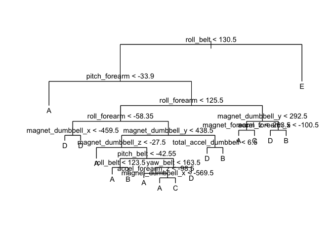
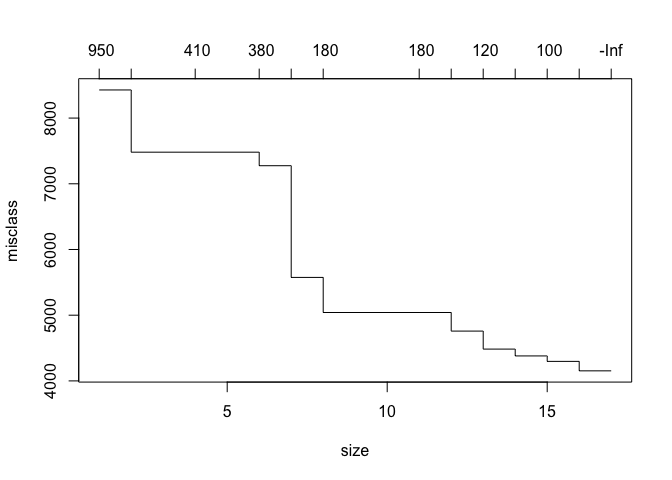
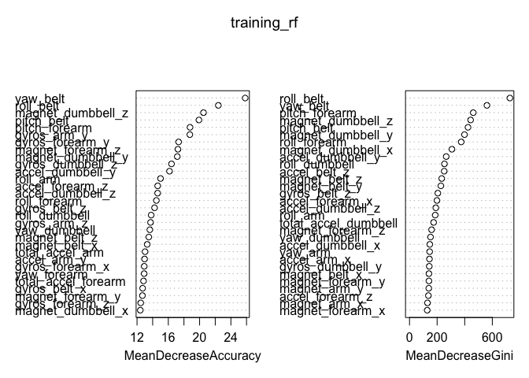

Introduction
------------

Using devices such as Jawbone Up, Nike FuelBand, and Fitbit it is now
possible to collect a large amount of data about personal activity
relatively inexpensively. These type of devices are part of the
quantified self movement – a group of enthusiasts who take measurements
about themselves regularly to improve their health, to find patterns in
their behavior, or because they are tech geeks.

One thing that people regularly do is quantify how much of a particular
activity they do, but they rarely quantify how well they do it. In this
project, your goal will be to use data from accelerometers on the belt,
forearm, arm, and dumbell of 6 participants. They were asked to perform
barbell lifts correctly and incorrectly in 5 different ways.

More information is available from the website here:
<http://web.archive.org/web/20161224072740/http:/groupware.les.inf.puc-rio.br/har>
(see the section on the Weight Lifting Exercise Dataset).

The goal of your project is to predict the manner in which they did the
exercise. This is the "classe" variable in the training set. You may use
any of the other variables to predict with. You should create a report
describing how you built your model, how you used cross validation, what
you think the expected out of sample error is, and why you made the
choices you did. You will also use your prediction model to predict 20
different test cases. \`\`\`

Acquiring the data
------------------

The training data for this project are available here:

<https://d396qusza40orc.cloudfront.net/predmachlearn/pml-training.csv>

The test data are available here:

<https://d396qusza40orc.cloudfront.net/predmachlearn/pml-testing.csv>

The data for this project come from this source:
<http://web.archive.org/web/20161224072740/http:/groupware.les.inf.puc-rio.br/har>.

If you use the document you create for this class for any purpose please
cite them as they have been very generous in allowing their data to be
used for this kind of assignment.

Loading the required libraries and data
---------------------------------------

Firstly, we will download the data from the website load it into two
data frames: the training dataset and the testing dataset with 20
observations that will be evaluated on Coursera. Note, the testing
dataset has had the "classe" variable removed.

    library(caret)

    ## Warning: package 'caret' was built under R version 3.4.3

    ## Loading required package: lattice

    ## Loading required package: ggplot2

    ## Warning in as.POSIXlt.POSIXct(Sys.time()): unknown timezone 'zone/tz/2017c.
    ## 1.0/zoneinfo/Asia/Seoul'

    library(rpart)
    library(rpart.plot)
    library(tree)
    library(randomForest)

    ## randomForest 4.6-12

    ## Type rfNews() to see new features/changes/bug fixes.

    ## 
    ## Attaching package: 'randomForest'

    ## The following object is masked from 'package:ggplot2':
    ## 
    ##     margin

    # downloading the training data
    download.file(url = "https://d396qusza40orc.cloudfront.net/predmachlearn/pml-training.csv", 
                  destfile = "./pml-training.csv", method = "curl")

    # loading the training data
    pml_training <- read.csv("./pml-training.csv", na.strings=c("NA","#DIV/0!",""))

    # downloading the testing data
    download.file(url = "https://d396qusza40orc.cloudfront.net/predmachlearn/pml-testing.csv", 
                  destfile = "./pml-testing.csv", method = "curl")

    # loading the testing data
    pml_testing <- read.csv("./pml-testing.csv", na.strings=c("NA","#DIV/0!",""))

Cleaning the data
-----------------

We remove the columns that contain NA and features that are not in the
testing dataset, leaving 53 features.

    remaining_features <- names(pml_testing[,colSums(is.na(pml_testing)) == 0])[8:59]

    pml_training_cleaned <- pml_training[,c(remaining_features,"classe")]
    pml_testing_cleaned <- pml_testing[,c(remaining_features,"problem_id")]

    dim(pml_training_cleaned); dim(pml_testing_cleaned);

    ## [1] 19622    53

    ## [1] 20 53

Partitioning data into testing and training sets
------------------------------------------------

By using the recommendation of splitting data into 60% training and 40%
testing sets for medium size studies, we can estimate out of sample
error in the testing set. This is not the same as the FINAL testing set
evaluated in COURSERA.

    set.seed(1969)

    sort_train_test <- createDataPartition(pml_training_cleaned$classe, p=0.6, list=FALSE)
    training <- pml_training_cleaned[sort_train_test,]
    testing <- pml_training_cleaned[-sort_train_test,]

    dim(training)

    ## [1] 11776    53

    dim(testing)

    ## [1] 7846   53

Comparing Models
----------------

In order to compare the suitability of different models, we will try at
least two in order to find one that works well. We will begin by
building a tree model (using the 'tree' package), followed by a random
forests model (using the 'randomForests' package).

Building a Decision Tree Model
------------------------------

    library(tree)
    set.seed(1969)
    training_tree <- tree(classe ~ ., data=training)
    summary(training_tree)

    ## 
    ## Classification tree:
    ## tree(formula = classe ~ ., data = training)
    ## Variables actually used in tree construction:
    ##  [1] "roll_belt"            "pitch_forearm"        "roll_forearm"        
    ##  [4] "magnet_dumbbell_x"    "magnet_dumbbell_y"    "magnet_dumbbell_z"   
    ##  [7] "pitch_belt"           "yaw_belt"             "accel_forearm_z"     
    ## [10] "total_accel_dumbbell" "magnet_forearm_z"     "accel_forearm_x"     
    ## Number of terminal nodes:  17 
    ## Residual mean deviance:  1.718 = 20210 / 11760 
    ## Misclassification error rate: 0.3378 = 3978 / 11776

We can see that the model has 17 terminal nodes.

Plotting is also helpful

    plot(training_tree)
    text(training_tree,pretty=0, cex=0.9)

We can also do a plot to visualize the terminal nodes. We can see from
that plot that the deviance decreases as the te size of the tree gets
smaller.

    visualize_tree=cv.tree(training_tree,FUN=prune.misclass)
    visualize_tree

    ## $size
    ##  [1] 17 16 15 14 13 12 11  8  7  6  4  2  1
    ## 
    ## $dev
    ##  [1] 4153 4153 4297 4380 4484 4758 5041 5041 5575 7275 7481 7481 8428
    ## 
    ## $k
    ##  [1]     -Inf   0.0000 100.0000 109.0000 125.0000 161.0000 175.0000
    ##  [8] 182.6667 251.0000 380.0000 407.0000 420.0000 947.0000
    ## 
    ## $method
    ## [1] "misclass"
    ## 
    ## attr(,"class")
    ## [1] "prune"         "tree.sequence"

    plot(visualize_tree)

We can also calculate the out of sample error rate by evaluating the
testing data.

    tree_predictions=predict(training_tree,testing,type="class")
    prediction_matrix = with(testing,table(tree_predictions,classe))
    sum(diag(prediction_matrix))/sum(as.vector(prediction_matrix)) ## calculating for accuracy in tree model

    ## [1] 0.657405

Unfortuntately, we can see the mediocre performance of the tree model
we've built when applied to the testing dataset. For this reason, we
will now build a random forests model.

Building a Random Forest Model
------------------------------

The random forest model amplifies the effectiveness of many weak tree
predictors. We are using the 'randomForest' package.

    set.seed(1969)
    training_rf=randomForest(classe~.,data=training,ntree=100, importance=TRUE)
    training_rf

    ## 
    ## Call:
    ##  randomForest(formula = classe ~ ., data = training, ntree = 100,      importance = TRUE) 
    ##                Type of random forest: classification
    ##                      Number of trees: 100
    ## No. of variables tried at each split: 7
    ## 
    ##         OOB estimate of  error rate: 0.8%
    ## Confusion matrix:
    ##      A    B    C    D    E class.error
    ## A 3341    5    0    0    2 0.002090800
    ## B   14 2256    9    0    0 0.010092146
    ## C    0   21 2025    7    1 0.014118793
    ## D    0    0   28 1901    1 0.015025907
    ## E    0    1    3    2 2159 0.002771363

We can see that the OOB estimate of error rate in-sample is 80%.

We will produce a variable importance plot to visualize which variables
are having a higher impact on the prediction.

    #plot(training_rf, log="y")
    varImpPlot(training_rf)

Let's apply this model on the testing dataset and determine the
suitability of the model.

    tree_predictions=predict(training_rf,testing,type="class")
    prediction_matrix = with(testing,table(tree_predictions,classe))
    sum(diag(prediction_matrix))/sum(as.vector(prediction_matrix)) # calculating for accuracy in random forests model

    ## [1] 0.9928626

We can see that the superb accuracy (better than 0.99) means our random
forests model is ideal.

We will use it to evaluate the Coursera Quiz testing set

Evaluating Coursera Quiz testing set
------------------------------------

    evaluating_quiz_testing_set <- predict(training_rf, pml_testing)
    evaluating_quiz_testing_set

    ##  1  2  3  4  5  6  7  8  9 10 11 12 13 14 15 16 17 18 19 20 
    ##  B  A  B  A  A  E  D  B  A  A  B  C  B  A  E  E  A  B  B  B 
    ## Levels: A B C D E

These predictions pass the Coursera Quiz without error.
